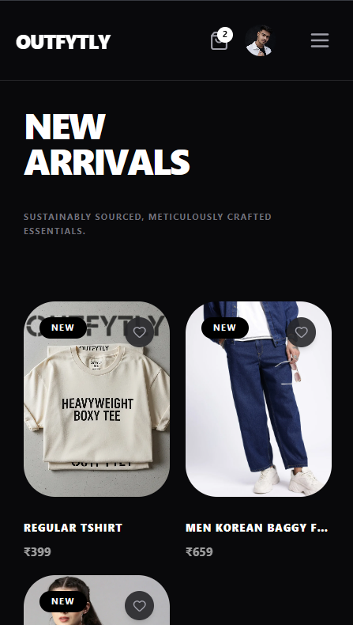
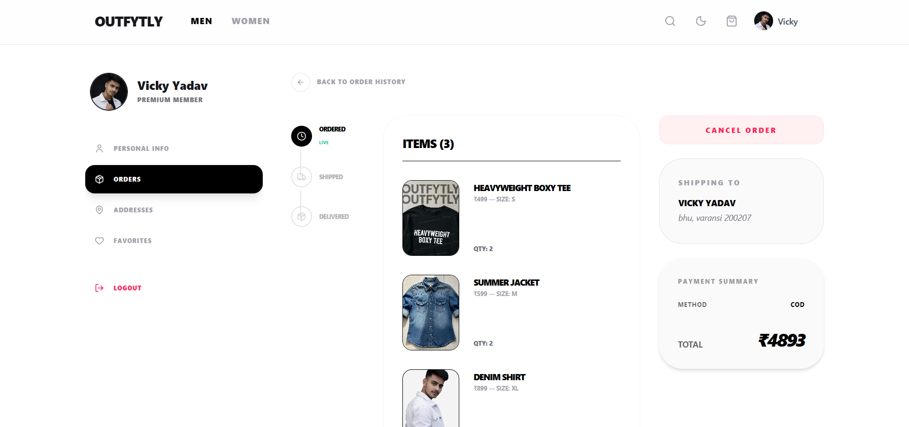
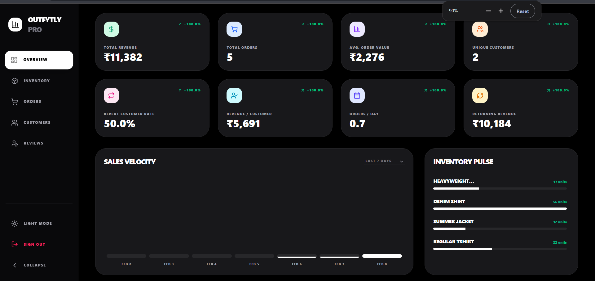
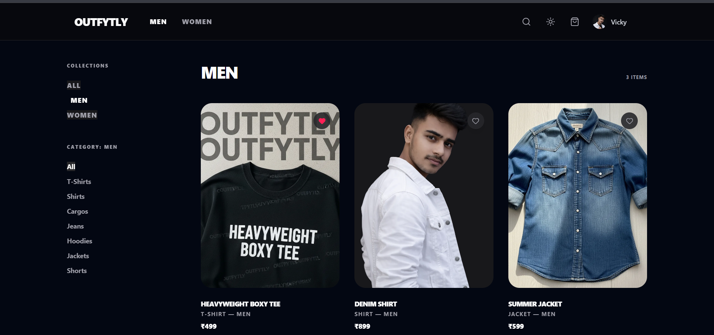
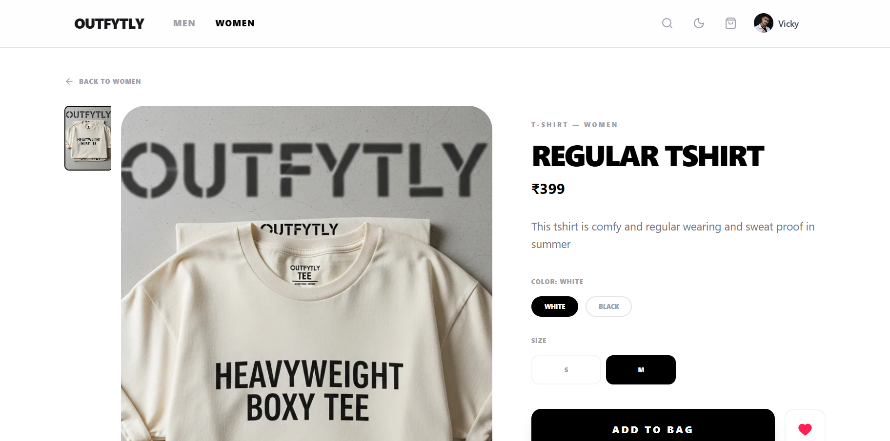
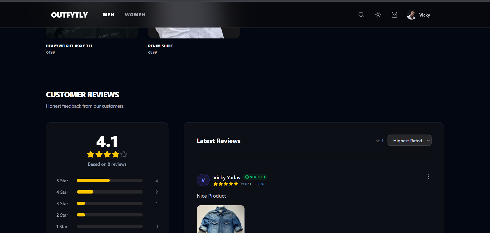
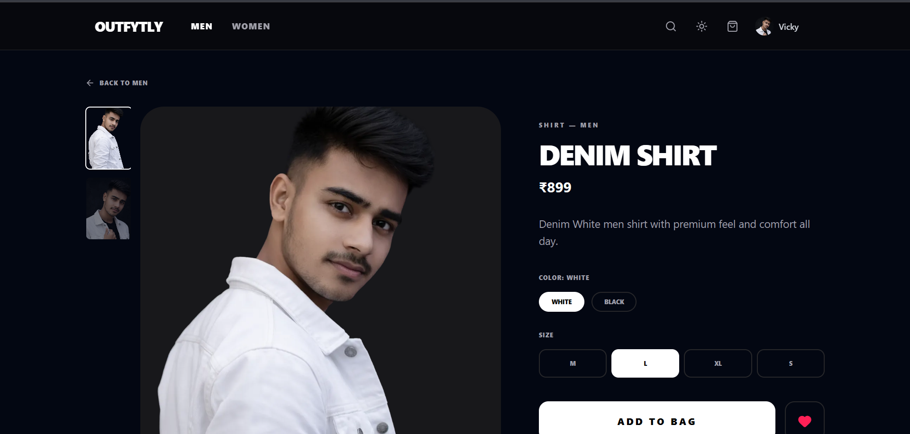

# 👕 Outfytly – MERN Clothing E-Commerce Platform


A **full-stack clothing e-commerce platform** built with the **MERN stack (MongoDB, Express, React, Node.js)** featuring **role-based authentication, Google OAuth, advanced product management, analytics dashboard, and a modern UI**.

Outfytly is designed to simulate a **real-world production e-commerce system**, including customer features, admin controls, and analytics insights.

---

# 🚀 Live Demo

🔗 **Live App:**
[Outfytly](https://outfytly.onrender.com/)

💻 **Source Code:**
[GitHub](https://github.com/PrveenYadav/Full-stack-Journey/tree/main/Full-stack-Projects/e-commerce-app)

---

# ✨ Features

## 🔐 Authentication & Security

* Role-based **Authentication & Authorization**
* **JWT Authentication**
* **Google OAuth Login**
* Secure **cookie-based sessions**
* **Password hashing with bcrypt**
* Email notifications
* Secure file uploads with **Multer**
* Image hosting via **ImageKit**

---

## 🛍 User Experience

* Clean and modern **UI/UX**
* Product **filtering and search**
* **Wishlist system**
* **Shopping cart**
* **Address management**
* **Best Sellers & New Arrivals sections**
* **Product recommendations**
* **User profile & account management**

---

## 👕 Smart Product Details

* Product **variants** (size & color)
* **Multiple product images**
* **Rated review filters**
* **Product recommendations**
* **Review system** (after order delivery)

---

## 💳 Checkout & Orders

* **Cash on Delivery (COD)**
* Complete **order tracking**
* Order history
* Secure checkout flow

---

# 📊 Admin Dashboard

A **data-driven admin panel** designed for business insights and store management.

### 🛠 Management

* Product management
* Order management
* Customer management
* Review moderation
* Advanced order filtering & search

### 📈 Business Analytics

Admin dashboard includes visual metrics such as:

* Total Revenue
* Total Orders
* Average Order Value (AOV)
* Unique Customers
* Repeat Customers
* Revenue per Customer
* Orders per Day
* Returning Revenue
* Growth / Loss Percentage
* Sales Velocity

  * Last 7 Days
  * 1 Month
  * 6 Months
  * 1 Year

### 📄 Reporting

* Export **customer reports to PDF**
* Export **dashboard analytics to PDF**

---

# 🧰 Tech Stack

## Frontend

* React.js
* Context API
* Axios
* Tailwind CSS
* React Toast Notifications

## Backend

* Node.js
* Express.js
* MongoDB
* JWT Authentication
* Google OAuth

## Other Tools & Services

* ImageKit (image storage)
* Multer (file uploads)
* Cookie Parser
* Brevo Email Service
* PDF Export System

---

# 📂 Project Structure

```
Outfytly
│
├── client/          # React Frontend
│
├── server/          # Node + Express Backend
│
├── models/          # MongoDB Schemas
├── routes/          # API Routes
├── controllers/     # Business Logic
├── middleware/      # Authentication & Security
│
└── README.md
```

---

# ⚙️ Installation & Setup

### 1️⃣ Clone the repository

```
git clone https://github.com/PrveenYadav/Full-stack-Journey.git
cd Full-stack-Projects/e-commerce-app
```

---

### 2️⃣ Install dependencies

Frontend

```
cd client
npm install
```

Backend

```
cd server
npm install
```

---

### 3️⃣ Environment Variables

Create `.env` file inside `server`

```
PORT =
MONGODB_URI=

JWT_SECRET=

# ImageKit
IMAGEKIT_PUBLIC_KEY=
IMAGEKIT_PRIVATE_KEY=
IMAGEKIT_URL_ENDPOINT=

NODE_ENV=

# Brevo Api Key
BREVO_API_KEY=
SENDER_EMAIL=

# Google OAuth
GOOGLE_CLIENT_ID=

CLIENT_URL=
```

Create `.env` file inside `client`
```
VITE_BACKEND_URL=
VITE_GOOGLE_CLIENT_ID=
```

---

### 4️⃣ Run the application

Backend

```
npm run start
```

Frontend

```
npm run dev
```

---

# 📸 Screenshots

### Home Page


### My Account


### Admin Dashboard


### Products Collection


### Product View
 

### Product Reviews


### Product View


---

# 🧠 What I Learned

Building Outfytly helped me gain deeper experience in:

* Designing **real-world scalable MERN applications**
* Implementing **secure authentication systems**
* Building **data-driven dashboards**
* Managing **complex product & order flows**
* Handling **production-level architecture**

---

# 🤝 Feedback

I would love to hear your feedback and suggestions.

If you like this project, consider giving it a ⭐ on GitHub!

---

# 👨‍💻 Author

**Praveen Yadav**

Connect with me:

* [LinkedIn](https://www.linkedin.com/in/prveen-yadav/)
* [Twitter](https://x.com/prveen_yadav_)
* [GitHub](https://github.com/PrveenYadav)
