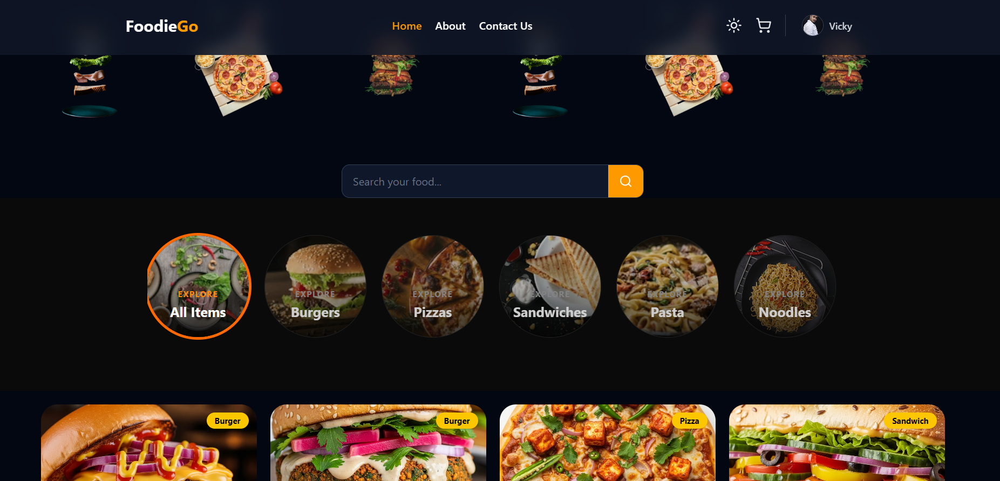
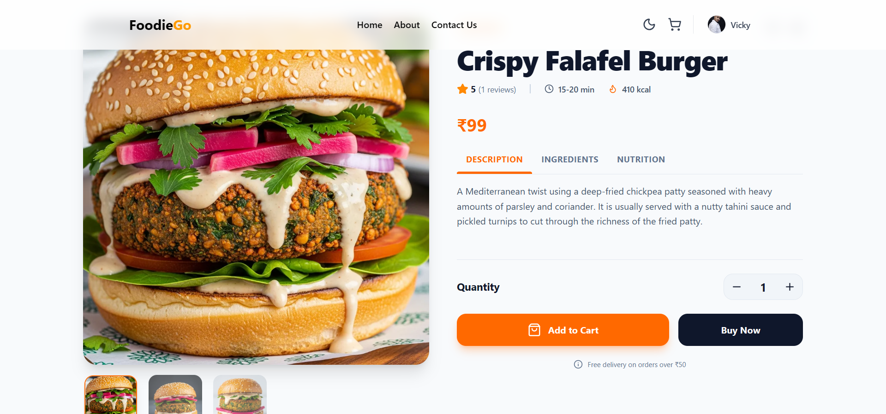
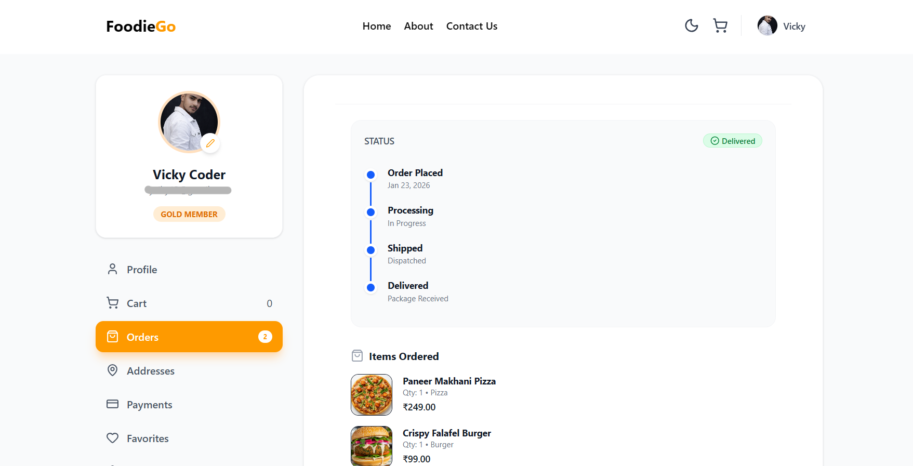
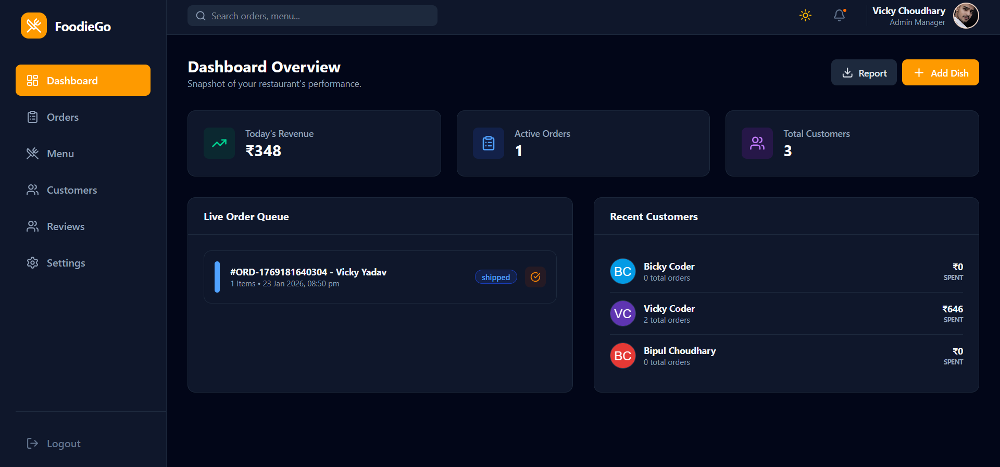
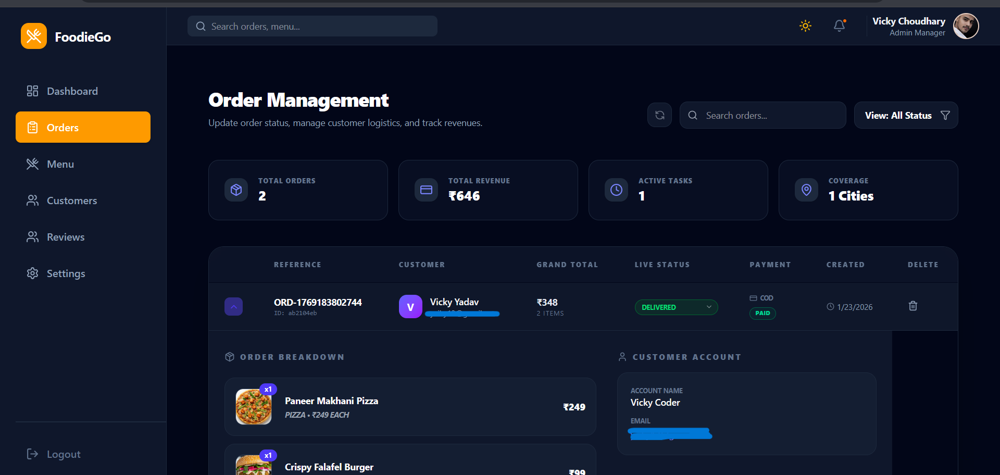

# 🍔 FoodieGo — Full Stack MERN Food Ordering Platform

FoodieGo is a **feature-rich full-stack MERN food ordering platform** designed for both **users and administrators**.
It combines a **modern React user experience** with a **scalable Node.js backend** and **powerful analytics dashboard**.

The platform focuses on **real-time insights, seamless food browsing, and efficient order management**, making it a complete production-ready food platform.

---
## 🔗 Live Demo

**Live App:**
[FoodieGo](https://foodiegoin.onrender.com)

---

## 🚀 Project Overview

FoodieGo was built to explore how real-world platforms manage **user interactions, analytics dashboards, and administrative operations**.

The project emphasizes:

* Smooth **user experience**
* Powerful **admin analytics**
* Secure **authentication system**
* Efficient **data management**

---

## ✨ Key Features

### ⚡ Admin Dashboard

A powerful control center for administrators.

* 📊 **Real-time analytics** – Track today's revenue, total orders, and platform performance.
* 👥 **Customer insights** – Monitor customer spending and identify top buyers.
* 📦 **Order management** – Filter and manage orders easily.
* 📄 **PDF Export** – Generate downloadable reports for dashboard and customers.

---

### 🍕 User Experience

* 🛒 **Smart food browsing** with ingredients and nutritional details.
* ⭐ **Dynamic review system** that calculates average ratings.
* 👤 **User accounts** with profile image support.
* 📦 **Order tracking** and order history.
* 💬 **Write and read product reviews.**

---

## 🛠 Tech Stack

### Frontend

* React.js
* Context API
* Axios
* Toast Notifications

### Backend

* Node.js
* Express.js

### Database

* MongoDB

### Authentication

* JWT Authentication

### Media Handling

* ImageKit
* Multer

---

## 🧩 Architecture

```
React Frontend
      ↓
Axios API Requests
      ↓
Node.js + Express API
      ↓
MongoDB Database
```

---

## 📸 Screenshot

Here are the screenshots.

### Home Page


### Product View


### Product View


### Admin Dashboard


### Order Management


---

## ⚙️ Installation

Clone the repository

```
git clone https://github.com/PrveenYadav/Full-stack-Journey.git
cd Full-stack-Projects/foodiego-app
```

Install dependencies

```
npm install
```

Run backend

```
cd backend
npm run dev
```

Run frontend

```
cd frontend
npm start
```

---

## 🔐 Environment Variables

Create `.env` file in backend:

```
PORT=
MONGODB_URI=

JWT_SECRET=

# ImageKit
IMAGEKIT_PUBLIC_KEY=
IMAGEKIT_PRIVATE_KEY=
IMAGEKIT_URL_ENDPOINT=

NODE_ENV=

# smtp host for sending emails
SMTP_HOST=
SMTP_PORT=
SMTP_USER=
SMTP_PASS=
SENDER_EMAIL=

CLIENT_URL=
```
---

Create `.env` file in frontend:

```
VITE_BACKEND_URL=
```

---

## 🎯 Learning Outcomes

Building FoodieGo helped me understand:

* Building scalable **MERN stack applications**
* Creating **analytics dashboards**
* Managing **admin permissions**
* Implementing **secure authentication**
* Handling **file uploads and media services**

---

## 📌 Future Improvements

* Online payment integration
* Real-time order notifications
* Mobile responsiveness improvements
* Additional some features

---

## 👨‍💻 Author

**Praveen Yadav**

🤝 **Connect:** [Linkedin](https://www.linkedin.com/in/prveen-yadav/) | [Twitter](https://x.com/prveen_yadav_)

---

⭐ If you like this project, consider giving it a star on GitHub!
