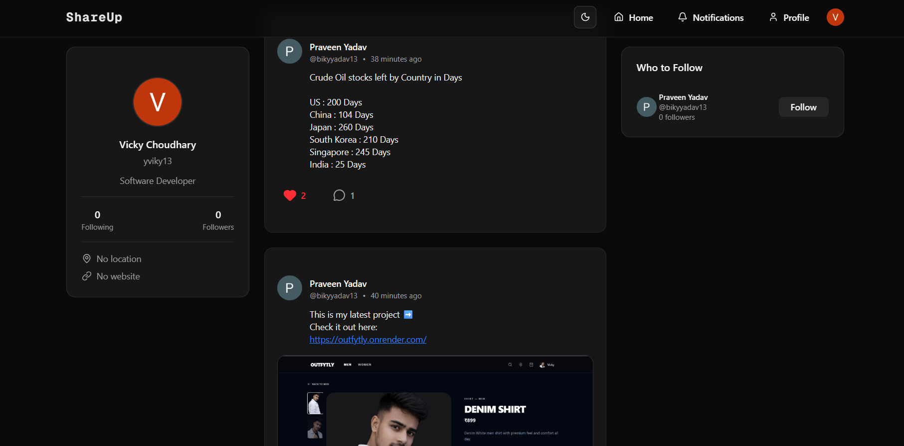
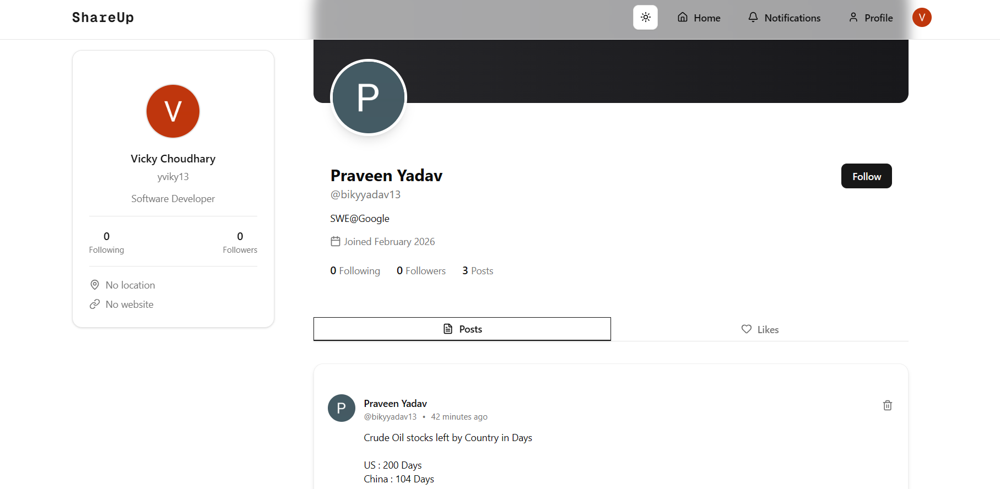

# Twitter Clone (Next.js Full Stack)

A full-stack Twitter-like social media application built with **Next.js**. Users can create posts with a rich text editor, upload images, interact with other users, and manage their profiles. The project demonstrates modern full-stack development using a scalable tech stack. This is my **First Next.js Project**.

---

## 🚀 Features

* 🔐 Authentication with **Clerk**
* ✍️ Create posts using **Tiptap Rich Text Editor**
* 🖼️ Image upload with **Cloudinary**
* ❤️ Like and 💬 comment on posts
* 🗑️ Delete your own posts
* 👤 User profile page
* ✏️ Edit profile information
* 🔔 Notification page
* ➕ Follow / Unfollow users
* 📱 Responsive UI using **ShadCN UI**

---

## 🛠️ Tech Stack

**Frontend**

* Next.js
* React
* Tailwind CSS
* ShadCN UI
* Tiptap Editor

**Backend**

* Next.js Server Actions / API Routes
* Prisma ORM
* Neon PostgreSQL

**Authentication**

* Clerk

**Media Storage**

* Cloudinary

---

## 📂 Project Structure

```
/app        → Next.js app router pages
/components → Reusable UI components
/lib        → Utility functions and configs
/prisma     → Prisma schema and database setup
/actions    → Server actions for posts, likes, comments
```

---

## ⚙️ Environment Variables

Create a `.env` file in the root and add the following:

```
DATABASE_URL=

NEXT_PUBLIC_CLERK_PUBLISHABLE_KEY=
CLERK_SECRET_KEY=

NEXT_PUBLIC_CLOUDINARY_CLOUD_NAME=
CLOUDINARY_API_KEY=
CLOUDINARY_API_SECRET=
```

---

## 📦 Installation

Clone the repository:

```
git clone https://github.com/PrveenYadav/Full-stack-Journey.git
```

Go to the project directory:

```
cd nextjs-projects/shareup
```

Install dependencies:

```
npm install
```

Run the development server:

```
npm run dev
```

---

## 🌐 Live Demo

Deployed project link:

```
https://shareupin.vercel.app/
```

---

## 📸 Screenshots

These are screenshots of:

### Home Feed


### Profile Page


---

## 👨‍💻 Author

Built by **Praveen Yadav**

If you like this project, consider giving it a ⭐ on GitHub!
